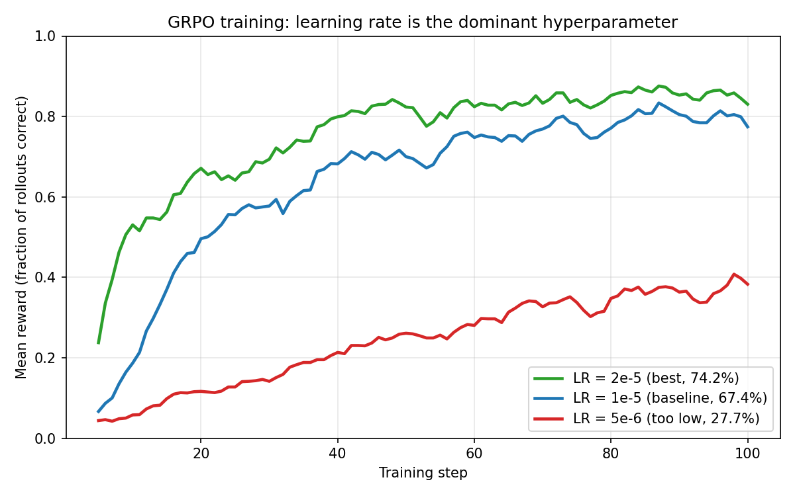

# GRPO from Scratch


A from-scratch implementation of **Group Relative Policy Optimization (GRPO)** — the core RL algorithm behind [DeepSeek-R1](https://arxiv.org/abs/2501.12948) — applied to mathematical reasoning.

This repo contains training code for fine-tuning a 1.5B parameter language model (Qwen2.5-Math-1.5B, downloaded from HuggingFace at runtime) to solve competition-level math problems using only outcome-based rewards, no process supervision.

## Key Results

Starting from a base model with ~19% accuracy on MATH, GRPO training reaches **74.2%** accuracy:




| Experiment | Variant | LR | Val Accuracy |
|---|---|---|---|
| Baseline (200 steps) | with_baseline | 1e-5 | 67.4% |
| **Best: LR=2e-5** | with_baseline | 2e-5 | **74.2%** |
| Minimal prompt | with_baseline | 1e-5 | 72.1% |
| Off-policy K=4 (unclipped) | unclipped | 1e-5 | 68.8% |
| Length normalization | with_baseline | 1e-5 | 67.1% |
| Off-policy K=4 (clipped) | clipped | 1e-5 | 60.3% |
| No std normalization | with_baseline | 1e-5 | 51.9% |
| No baseline | no_baseline | 1e-5 | 19.5% |

## What's Implemented

**GRPO algorithm variants:**
- Baseline subtraction (REINFORCE with baseline vs. vanilla)
- PPO-style clipping for off-policy reuse
- Group advantage normalization (mean and std)
- Length normalization option

**Training pipeline:**
- SFT warmup stage → GRPO fine-tuning
- vLLM for fast batched generation (separate GPU)
- Gradient accumulation with grad norm clipping
- W&B logging and periodic evaluation

**Reward function:**
- Outcome-based: extracts answer from `<answer>` tags, checks correctness via symbolic math (SymPy)
- No process reward model needed

## Project Structure

```
grpo/
  utils.py           # Tokenization, log-prob computation
  policy_gradient.py  # Core PG loss: ratio, clipping, advantages
  rewards.py          # Group advantage normalization
  training.py         # SFT and GRPO step functions
  grading.py          # Math answer extraction and verification
  evaluation.py       # Batch evaluation on MATH problems
prompts/
  reasoning.txt       # Chain-of-thought prompt template
  minimal.txt         # Direct-answer prompt template
tests/
  test_core.py        # Unit tests for losses, advantages, masked reductions
train.py              # GRPO training loop
train_sft.py          # SFT training loop
```

## Tests

Pure-CPU unit tests covering the math (no GPU, no model download):

```bash
pytest tests/test_core.py
```

## Quick Start

```bash
pip install -r requirements.txt

# SFT stage
python train_sft.py \
    --model_path Qwen/Qwen2.5-Math-1.5B \
    --train_data data/sft.jsonl \
    --val_data data/validation.jsonl \
    --output_dir outputs/sft_model

# GRPO stage (requires 2 GPUs)
python train.py \
    --model_path outputs/sft_model \
    --train_data data/train.jsonl \
    --val_data data/validation.jsonl \
    --output_dir outputs/grpo_model \
    --lr 2e-5 \
    --n_steps 100
```

## Training Dynamics

A healthy RL run shows reward rising as policy entropy falls — the model transitions from exploration (trying diverse answers) to exploitation (committing to strategies that work). Monitoring entropy is the first line of defense against mode collapse:


## Ablation Highlights


Key findings from the experiments:

1. **Baseline subtraction is critical** — without it, training collapses (19.5% vs 67.4%)
2. **Std normalization matters** — removing it drops accuracy from 67.4% to 51.9%
3. **Higher LR helps** — 2e-5 significantly outperforms 1e-5 (74.2% vs 67.4%)
4. **Off-policy reuse** — reusing rollouts K=4 times without clipping (68.8%) outperforms with clipping (60.3%), suggesting the KL divergence stays small enough that clipping hurts more than it helps at this scale
5. **Minimal prompts work well** — direct-answer format (72.1%) is competitive with chain-of-thought (67.4%), though format accuracy is similar

## Requirements

- 2× GPUs (one for training, one for vLLM inference)
- ~24GB VRAM per GPU for the 1.5B model
- Python 3.10+, PyTorch 2.0+, vLLM 0.4+

## License

MIT
