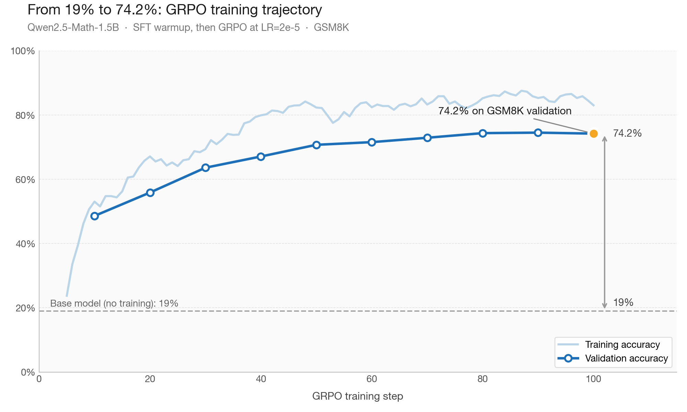
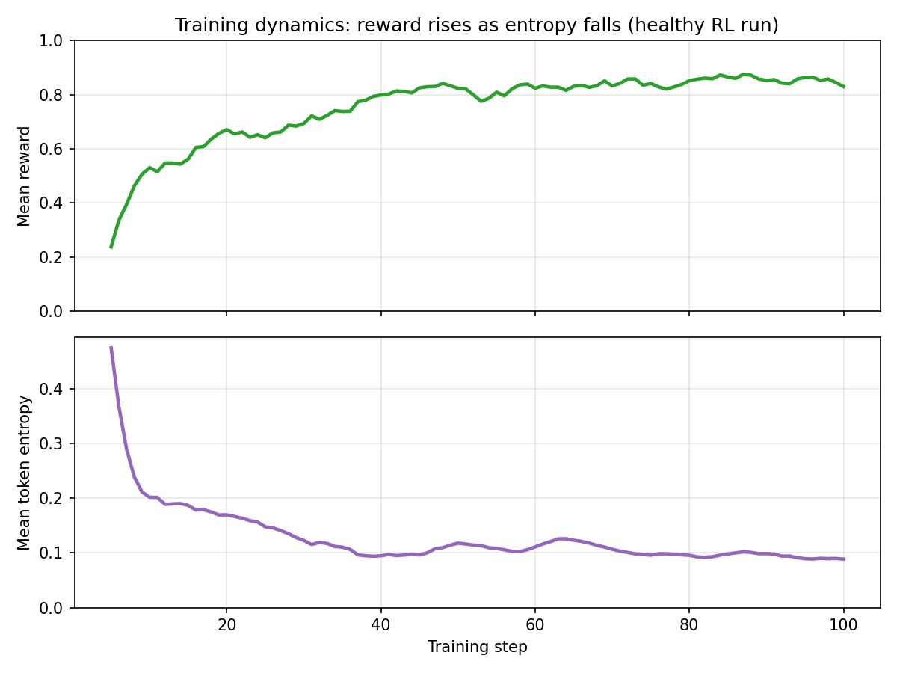
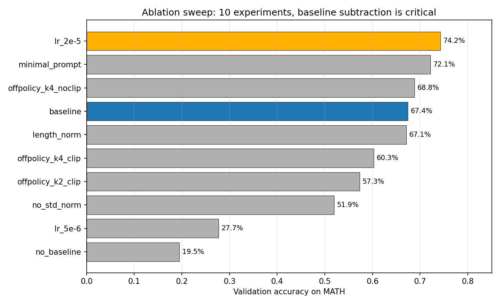

# GRPO from Scratch


A from-scratch implementation of **Group Relative Policy Optimization (GRPO)** — the core RL algorithm behind [DeepSeek-R1](https://arxiv.org/abs/2501.12948) — applied to mathematical reasoning.

This repo contains training code for fine-tuning a 1.5B parameter language model (Qwen2.5-Math-1.5B, downloaded from HuggingFace at runtime) to solve grade school math problems (GSM8K) using only outcome-based rewards, no process supervision.

## Key Results

Starting from a base model with ~19% accuracy on GSM8K, GRPO training reaches **74.2%** accuracy:



The light line is per-step training accuracy (the model's accuracy on the questions it's currently practicing on). The dark line is validation accuracy on held-out GSM8K questions, measured every 10 steps — the honest number we report.


| Experiment | Variant | LR | Val Accuracy |
|---|---|---|---|
| Baseline (200 steps) | with_baseline | 1e-5 | 67.4% |
| **Best: LR=2e-5** | with_baseline | 2e-5 | **74.2%** |
| Minimal prompt | with_baseline | 1e-5 | 72.1% |
| Off-policy K=4 (unclipped) | unclipped | 1e-5 | 68.8% |
| Length normalization | with_baseline | 1e-5 | 67.1% |
| Off-policy K=4 (clipped) | clipped | 1e-5 | 60.3% |
| No std normalization | with_baseline | 1e-5 | 51.9% |
| No baseline | no_baseline | 1e-5 | 19.5% |

## What's Implemented

**GRPO algorithm variants:**
- Baseline subtraction (REINFORCE with baseline vs. vanilla)
- PPO-style clipping for off-policy reuse
- Group advantage normalization (mean and std)
- Length normalization option

**Training pipeline:**
- SFT warmup stage → GRPO fine-tuning
- vLLM for fast batched generation (separate GPU)
- Gradient accumulation with grad norm clipping
- W&B logging and periodic evaluation

**Reward function:**
- Outcome-based: extracts answer from `<answer>` tags, checks correctness via symbolic math (SymPy)
- No process reward model needed

## Project Structure

```
grpo/
  utils.py           # Tokenization, log-prob computation
  policy_gradient.py  # Core PG loss: ratio, clipping, advantages
  rewards.py          # Group advantage normalization
  training.py         # SFT and GRPO step functions
  grading.py          # Math answer extraction and verification
  evaluation.py       # Batch evaluation on GSM8K problems
prompts/
  reasoning.txt       # Chain-of-thought prompt template
  minimal.txt         # Direct-answer prompt template
tests/
  test_core.py        # Unit tests for losses, advantages, masked reductions
train.py              # GRPO training loop
train_sft.py          # SFT training loop
```

## Tests

Pure-CPU unit tests covering the math (no GPU, no model download):

```bash
pytest tests/test_core.py
```

## Quick Start

```bash
pip install -r requirements.txt

# SFT stage
python train_sft.py \
    --model_path Qwen/Qwen2.5-Math-1.5B \
    --train_data data/sft.jsonl \
    --val_data data/validation.jsonl \
    --output_dir outputs/sft_model

# GRPO stage (requires 2 GPUs)
python train.py \
    --model_path outputs/sft_model \
    --train_data data/train.jsonl \
    --val_data data/validation.jsonl \
    --output_dir outputs/grpo_model \
    --lr 2e-5 \
    --n_steps 100
```

## Training Dynamics

A healthy RL run shows reward rising as policy entropy falls — the model transitions from exploration (trying diverse answers) to exploitation (committing to strategies that work). Monitoring entropy is the first line of defense against mode collapse:



## Ablation Highlights

All 10 runs use the same GRPO training pipeline (G=8 group sampling, GSM8K, post-SFT Qwen2.5-Math-1.5B, outcome rewards). Each run modifies one component:

| # | Experiment | What's changed |
|---|---|---|
| 1 | baseline | Reference GRPO config (LR=1e-5) |
| 2 | no_baseline | Group mean subtraction removed |
| 3 | lr_5e-6 | Lower learning rate |
| 4 | lr_2e-5 | Higher learning rate |
| 5 | length_norm | Length normalization on |
| 6 | no_std_norm | Std normalization removed |
| 7 | offpolicy_k4_clip | K=4 rollout reuse, PPO clipping on |
| 8 | offpolicy_k2_clip | K=2 rollout reuse, PPO clipping on |
| 9 | offpolicy_k4_noclip | K=4 rollout reuse, PPO clipping off |
| 10 | minimal_prompt | Direct-answer prompt instead of CoT |



Key findings from the experiments:

**1. Baseline subtraction is doing all the work — 19.5% without, 67.4% with.**
GRPO samples 8 responses per question and scores each (1 = correct, 0 = wrong). Without subtracting the group mean, wrong responses produce zero gradient — only correct ones push the model. Sparse and noisy. Subtracting the mean turns wrong responses into negative advantages, so every response becomes a training signal. If 3 of 8 are correct (mean = 0.375), correct ones get advantage **+0.625**, wrong ones get **-0.375**. Same algorithm, one subtraction — 19% vs 67%.

**2. Std normalization matters more than expected — removing it drops accuracy 15 points (67.4% → 51.9%).**
Hypothesis: dividing by std keeps the effective learning rate stable across batches with different reward variance. When reward variance is high, raw advantages are large → gradient steps are huge → instability. When variance is low, advantages are tiny → weak signal. Std normalization flattens that out.

**3. Higher LR wins on a fixed step budget — 2e-5 hit 74.2%, 1e-5 stalled at 67.4%, 5e-6 didn't even beat the SFT baseline at 100 steps.**
Rollouts are expensive (vLLM generation dominates compute), so each gradient step has to count. More aggressive updates extract more signal per rollout batch. This probably doesn't generalize to longer training budgets — at some point higher LR overshoots — but on a fixed step budget, leaning aggressive paid off.

**4. PPO clipping actively hurt at this scale — 68.8% without it, 60.3% with it (K=4 off-policy reuse).**
Clipping zeros gradients on tokens whose probability ratio drifts past a threshold — designed to prevent runaway updates. Hypothesis: at 1.5B scale with a small learning rate, the policy doesn't drift far enough between updates for clipping's protection to matter, but the threshold still fires often enough to materially shrink useful gradient signal. Right safety mechanism, wrong regime.

**5. Minimal prompts beat chain-of-thought prompts — 72.1% vs 67.4%.**
Two prompts tested: one that just shows the question, and one that tells the model "think step by step" with a specific reasoning format. The minimal one won by 5 points. Hypothesis: SFT had already taught the model how to reason on these problems. Adding explicit instructions on top likely overrode that learned format, making GRPO spend gradient updates pushing against the prompt instead of refining what was already there. On this setup at least: if SFT did its job, your prompt may be competing with the model rather than helping it.

## Requirements

- 2× GPUs (one for training, one for vLLM inference)
- ~24GB VRAM per GPU for the 1.5B model
- Python 3.10+, PyTorch 2.0+, vLLM 0.4+

## License

MIT
